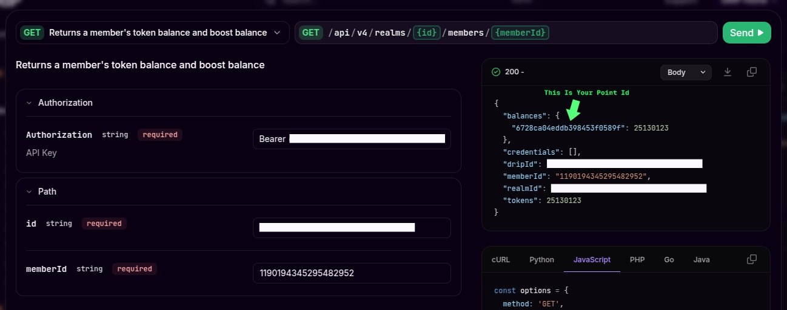

<p align="center">
  
</p>

[](https://opensource.org/licenses/MIT)


FlowSend is a powerful Discord bot designed for bulk tipping functionality, specifically built for the DRIP App. It provides a seamless way to manage and distribute tips to multiple users efficiently.

## 🌟 Features

- 💸 **Bulk Tipping**: Send tips to multiple users simultaneously via CSV file
- 💰 **Balance Management**: Track and manage your tip balance
- 📊 **Transaction History**: View detailed history of all your transactions
- 🔄 **Deposit/Withdraw**: Easily deposit and withdraw from your tip balance
- 📢 **Broadcast Messages**: Share transaction details in any channel
- ✅ **Automated Validation**: Built-in balance and transaction validation
- 🔒 **Secure**: All transactions are processed securely with proper error handling

## 🚀 Getting Started

### Prerequisites

- Node.js v16 or higher
- npm or yarn package manager
- Discord Bot Token
- DRIP API Key
- Access to Discord Developer Portal

### Installation

1. Clone the repository:

```bash
git clone https://github.com/yourusername/FlowSend.git
cd FlowSend
```

2. Install dependencies:

```bash
npm install
```

3. Create a `.env` file in the root directory with the following variables:

```env
BOT_NAME=YourBotName
DISCORD_TOKEN=your-discord-token
DISCORD_APP_ID=your-discord-app-id
DRIP_APIKEY=your-drip-api-key
REALMS_ID=your-realms-id
DRIP_POINTS_ID=your-drip-points-id
POINT_NAME=your-point-name
```

4. Start the bot:

```bash
npm start
```

For development:

```bash
npm run dev
```

## 📝 Usage

### CSV Format for Bulk Tipping

Prepare your CSV file with the following format:

```csv
userId,amount,note
1190194345295482952,6,Happy birthday
1190194345295482952,30,Monthly reward
```

Required fields:

- `userId`: Discord user ID (required)
- `amount`: Amount to tip (required)
- `note`: Optional message to include with the tip

### Commands

- `/bulktip` - Upload a CSV file to initiate bulk tipping
- `!show` - Display the main menu with balance and history options

### Features in Detail

#### Balance Management

- Check your current balance
- Deposit points to your tip balance
- Withdraw points from your tip balance

#### Transaction History

- View your last 10 transactions
- See transaction amounts and recipient counts
- Track transaction timestamps

#### Broadcasting

- Share transaction details in any channel
- Customize broadcast messages
- Control who can see the transaction details

> **TIPS**
>
> If You dont know to get point id
>
> Go To [here](https://docs.drip.re/legacy-api-reference/realm-controller/returns-a-members-token-balance-and-boost-balance?playground=open) fill with your credentials, and do as shown in the image below

<p align="center">
  
</p>
## 🛠️ Technical Details

### Built With

- Discord.js v14
- Better-SQLite3
- Node.js
- CSV Parser

### Database Structure

- SQLite database for user balances and transactions
- Write-Ahead Logging (WAL) for better performance
- Automatic table creation and management

## 🤝 Contributing

Contributions are welcome! Please feel free to submit a Pull Request.

1. Fork the repository
2. Create your feature branch (`git checkout -b feature/AmazingFeature`)
3. Commit your changes (`git commit -m 'Add some AmazingFeature'`)
4. Push to the branch (`git push origin feature/AmazingFeature`)
5. Open a Pull Request

## 📄 License

This project is licensed under the MIT License - see the [LICENSE](LICENSE) file for details.

## 🙏 Acknowledgments

- Discord.js team for the amazing Discord API wrapper
- DRIP team for their ecosystem
- All contributors and users of FlowSend

## 📞 Support

For support, please:

1. Check the [Issues](https://github.com/mallardlabs/FlowSend/issues) page
2. Create a new issue if your problem isn't already listed

---
